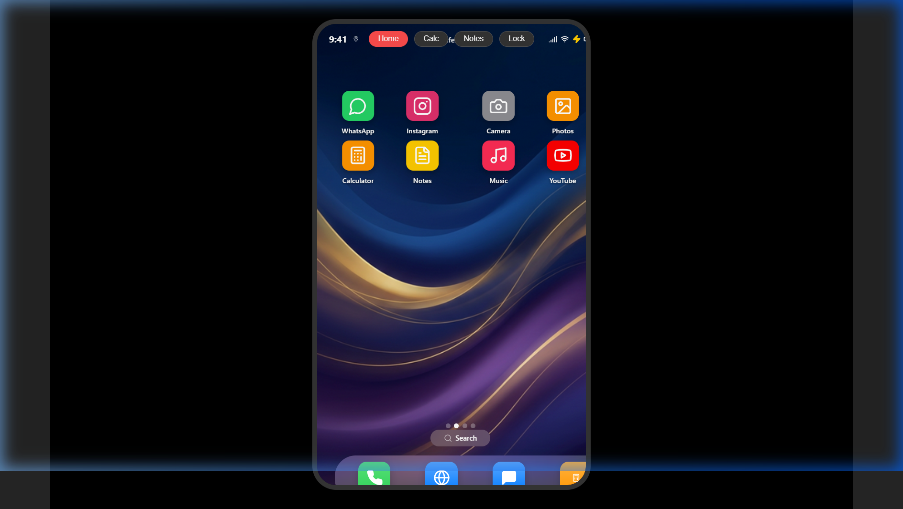
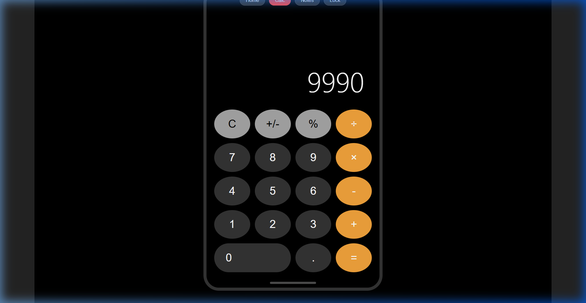
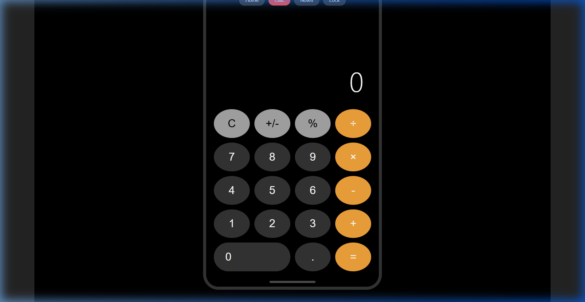

# SheSignal 🛡️📱

**SheSignal** is a discreet, high-security emergency assistance application designed to provide safety and support in situations where a user cannot openly ask for help. It is camouflaged as a fully functional, realistic mobile interface with various common app disguises.

## 🌟 Key Features

- **Multi-Layered Camouflage:** Mimics a modern smartphone with a realistic home screen, app dock, and widgets.
- **Hidden Triggers:** Active safety features via secret calculator codes, hidden notes phrases, or deliberate PIN errors.
- **High Danger SOS:** A secondary "Emergency" level that simulates immediate notification to local authorities with high-priority location sharing.
- **Live GPS Tracking:** Silently broadcasts real-time coordinates to trusted contacts.
- **Background Audio Recording:** Discreetly records surrounding audio for evidence preservation.
- **Persistent Alert History:** Maintains a secure log of past triggers with status, location, and audio metadata.
- **Hidden Setup Screen:** Securely manage contacts and trigger codes via a secret gesture (Double-tap in Calculator).

## 🛠️ Tech Stack

- **Framework:** React 18 (Vite)
- **Styling:** Vanilla CSS3 with Glassmorphism
- **Animations:** Framer Motion
- **Icons:** Lucide React
- **APIs:** Geolocation API, MediaRecorder API, LocalStorage API
- **Deployment:** Vercel / Netlify

## 🚀 Installation & Usage

### Prerequisites
- Node.js (v18+)
- npm or yarn

### Installation
```bash
# Clone the repository
git clone https://github.com/navyacv2-art/TINKHERHACK.git

# Navigate to project folder
cd "TINK HER HACK"

# Install dependencies
npm install
```

### Running the App
```bash
# Start development server
npm run dev
```

## 📸 Media & Demos

### Screenshots
| Home Screen | Emergency Dashboard | Setup Screen |
|:---:|:---:|:---:|
|  |  |  |

### Demo Video
[View Demo Recording](./images/demo.webp)

## 🏗️ Architecture
For detailed flow and design diagrams, see [Docs/Architecture](./docs/architecture.md).

## 👥 Team
- **Project Lead:** Navya
- **AI Collaborator:** Antigravity (Google DeepMind)

## 📄 License
This project is licensed under the [MIT License](./LICENSE).

---
*Developed with ❤️ at TinkerHub*
