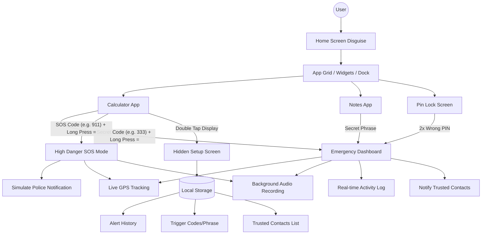

# SheSignal System Architecture

## Component Overview

### Frontend (React/Vite)
- **`App.jsx`**: Main controller handling disguise switching and emergency states.
- **`HomeScreen.jsx`**: Realistic mobile UI mimicking a modern smartphone.
- **`Calculator.jsx`**: Primary disguise with logic-based triggers.
- **`EmergencyDashboard.jsx`**: High-availability dashboard for safety operations.
- **`Setup.jsx`**: Administrative interface for user configuration.

### Data Layer
- **Local Storage**: Secure, client-side persistence for sensitive configurations and alert history.
- **Geolocation API**: High-precision tracking.
- **MediaRecorder API**: Foreground/Background audio acquisition.
