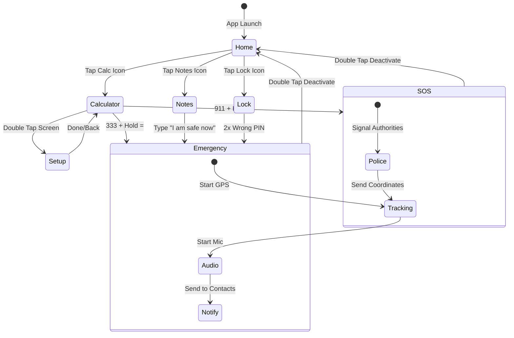

# SheSignal Application Flow

```mermaid
stateDiagram-v2
    [*] --> Home: App Launch
    Home --> Calculator: Tap Calc Icon
    Home --> Notes: Tap Notes Icon
    Home --> Lock: Tap Lock Icon
    
    Calculator --> Setup: Double Tap Screen
    Setup --> Calculator: Done/Back
    
    Calculator --> Emergency: 333 + Hold =
    Calculator --> SOS: 911 + Hold =
    Notes --> Emergency: Type "I am safe now"
    Lock --> Emergency: 2x Wrong PIN
    
    Emergency --> Home: Double Tap Deactivate
    SOS --> Home: Double Tap Deactivate
    
    state Emergency {
        [*] --> Tracking: Start GPS
        Tracking --> Audio: Start Mic
        Audio --> Notify: Send to Contacts
    }
    
    state SOS {
        [*] --> Police: Signal Authorities
        Police --> Tracking: Send Coordinates
    }
```
